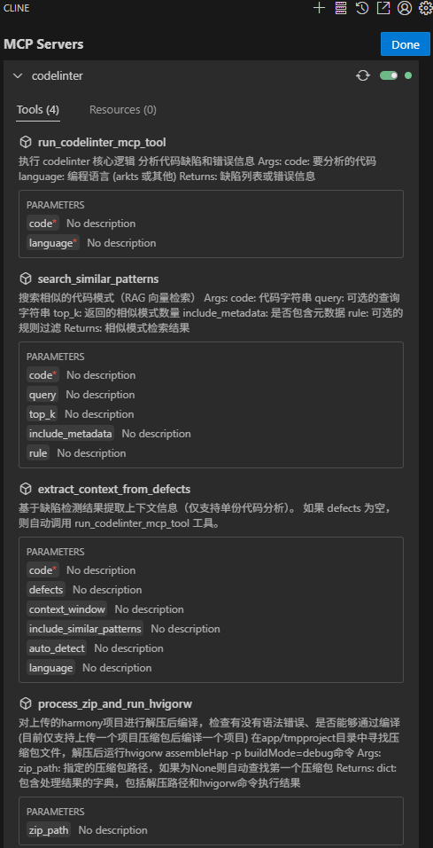
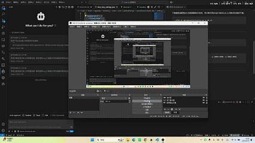

# code-fix
## 环境配置
在src/A21_C__open-harmony目录下运行命令解压压缩包
```
unzip A21_C__open-harmony.zip
```
前往HarmonyOS下载中心下载命令行工具到src/codelinter目录下并解压
```
unzip commandline-tools-linux-x64-5.1.1.823.zip
```
### 在models目录下运行以下命令 
下载hfd
```
wget https://hf-mirror.com/hfd/hfd.sh
chmod a+x hfd.sh
```
设置环境变量
```
export HF_ENDPOINT=https://hf-mirror.com
```
下载模型(模型较大可能需要较长时间，若中断可再次运行改命令从上次断点处继续下载)
```
./hfd.sh NovaSearch/stella_en_1.5B_v5
```
## 运行
回到根目录运行以下命令构建镜像
```
docker build -t <image_name>:latest .
```
启动镜像
```
docker run -d --name <image_name>   -p 8000:8000 -p 8001:8001 <image_name>:latest
```

## 功能
### 主体功能概览


### 代码缺陷检测


### 鸿蒙编译命令

需提前上传压缩好的harmony项目
```
curl.exe -X POST -F "file=@./<your_harmony_project_name>.zip" http://<your_ip>:8001/upload
```
请注意 鸿蒙编译命令仅支持上传一个项目再进行一次编译 请勿上传多个项目
压缩包内路径应直接为项目根目录 请勿包含多余的文件夹

.gif>)