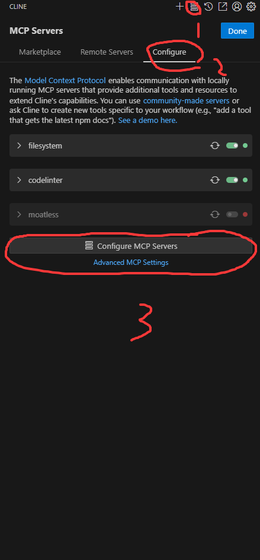

# cline配置mcp


写入mcp设置代码
```
{
  "mcpServers": {
    "codelinter": {
      "autoApprove": [],
      "disabled": false,
      "timeout": 60,
      "type": "sse",
      "url": "http://127.0.0.1:8000/sse"
    }
  }
}
```